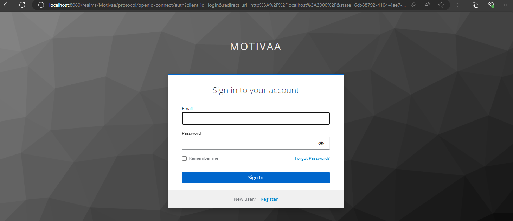
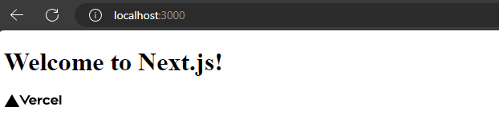

# MOTIVAA Next.js with Keycloak Authentication

## .env

Before installation, set .env with your Keycloak data

```yaml
NEXT_PUBLIC_KEYCLOAK_URL=http://localhost:8080
NEXT_PUBLIC_KEYCLOAK_REALM=your_realm
NEXT_PUBLIC_KEYCLOAK_CLIENT_ID=your_client_id
```
# Screenshots

### Before login

### After login



This project demonstrates a simple yet effective integration of Keycloak authentication within a Next.js (version 14) application. 

## Features

- **Keycloak Integration**: Utilizes Keycloak for robust authentication and authorization.
- **React Hooks**: Implements React hooks for state management and side effects.
- **Dynamic User Profiles**: Dynamically loads and displays user profiles post-authentication.
- **Secure Routing**: Ensures that pages are only accessible to authenticated users.

## Prerequisites

Before you begin, ensure you have the following installed:
- [Node.js](https://nodejs.org/) (version 12.x or later)
- [npm](https://www.npmjs.com/) (version 6.x or later)
- A running instance of [Keycloak](https://www.keycloak.org/)

## Getting Started

Follow these steps to get your Next.js app running with Keycloak authentication:

### 1. Clone the Repository

```bash
git clone https://github.com/csabika98/NextJS-Keycloak-JS.git
cd NextJS-Keycloak-JS
```

### 2. Install Dependencies
```bash
npm install
```

### 3. Configure Keycloak

Set .env with your Keycloak data


### 4. Start the Application

```bash
npm run dev
```

Navigate to `http://localhost:3000` to see your application in action. You will be redirected to the Keycloak login page if not authenticated.
